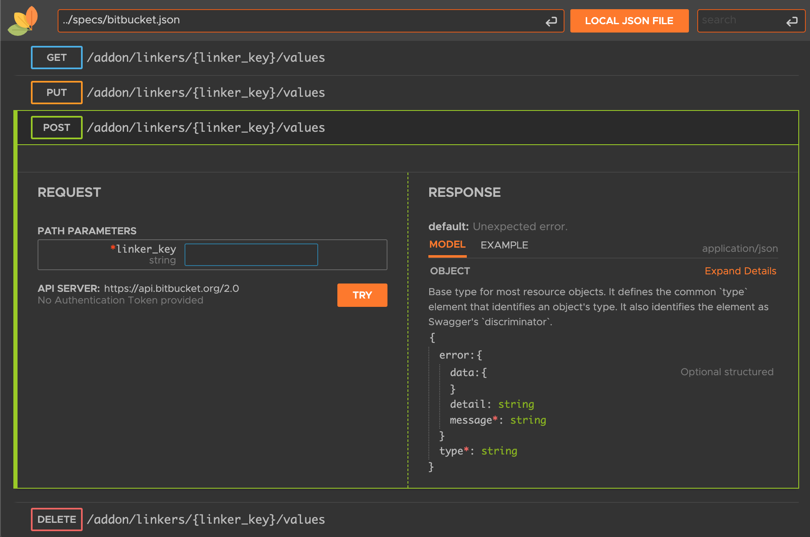
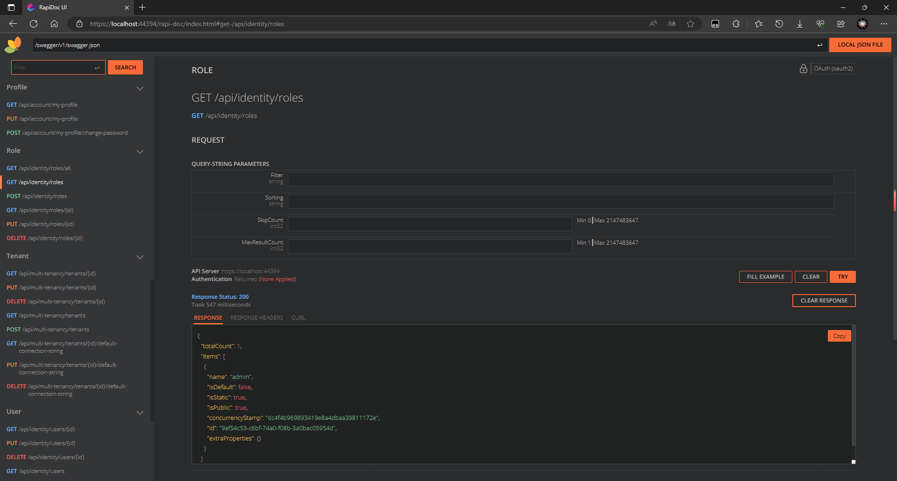
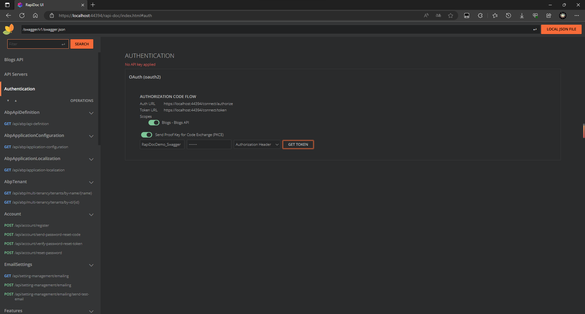
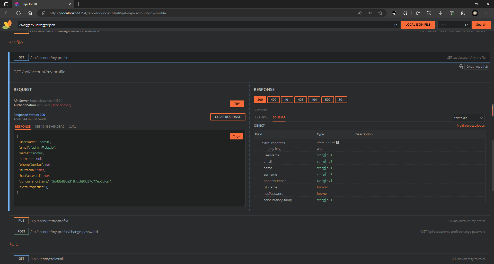

# 如何使用RapiDoc替换SwaggerUI

## 介绍

abp使用非常流行的 SwaggerUI 作为默认api文档页面. 但是如果你对它的UI感到厌倦, 可以尝试使用 [RapiDoc][def-rapi-doc] 替换Swagger-UI.

RapiDoc提供与SwaggerUI几乎相同的能力, 但是他的UI更加漂亮, 可定制化更高.



如果你对此感兴趣, 请继续阅读, 了解如何使用 [RapiDoc][def-rapi-doc] 作为您项目的文档页面.

## 创建一个新项目

在这里我使用单层模板进行演示, 对其他模板步骤相同. 你也可以在现有项目上完成后续步骤. 

```bash
abp new RapiDocDemo -t app-nolayers
```

## 安装RapiDoc

感谢[luoyunchong](https://github.com/luoyunchong)创建的[IGeekFan.AspNetCore.RapiDoc][def-dotnet-project]项目, 让我们刚容易使用RapiDoc.

让我们将RapiDoc添加到Web项目.

```bash
dotnet add package IGeekFan.AspNetCore.RapiDoc
```

## 创建abp.rapi-doc.js
在Web项目创建文件夹`wwwroot/rapi-doc`, 并使用以下内容创建`abp.rapi-doc.js`文件. 
```javascript
var abp = abp || {};

(function () {
    window.addEventListener('DOMContentLoaded', (event) => {
        var excludeUrl = ["swagger.json", "connect/token"]
        var firstRequest = true;

        /*
          Ensure that the DOM is loaded, then add the event listener.
          here we are listenig to 'before-try' event which fires when the user clicks
          on TRY, it then modifies the POST requests by adding a custom header
        */
        const rapidocEl = document.getElementById('thedoc');
        rapidocEl.addEventListener('before-try', async (e) => {
            var request = e.detail.request;
            if (request.url.includes(excludeUrl[1])) {
                firstRequest = true;
            }

            if (firstRequest && !excludeUrl.some(url => request.url.includes(url))) {
                await fetch(`${abp.appPath}abp/Swashbuckle/SetCsrfCookie`, {
                    headers: request.headers
                });
                firstRequest = false;
            }

            var antiForgeryToken = abp.security.antiForgery.getToken();
            if (antiForgeryToken) {
                request.headers.append(abp.security.antiForgery.tokenHeaderName, antiForgeryToken);
            }
        });
    });
})();
```

## 配置RapiDoc

配置RapiDocDemoModule. 

### 步骤1. 添加using.

```csharp
using IGeekFan.AspNetCore.RapiDoc;
```

### 步骤2. 配置`RapiDoc`.
   
按如下所示修改`ConfigureSwaggerServices`来配置`RapiDocOptions`.

```diff
private void ConfigureSwaggerServices(IServiceCollection services, IConfiguration configuration)
{
+   Configure<RapiDocOptions>(options =>
+   {
+       options.RoutePrefix = "rapi-doc";//access url

+       // optional
+       options.GenericRapiConfig.RenderStyle = "focused";// view | read | focused
+       options.GenericRapiConfig.Theme = "dark"; // light | dark
+       options.GenericRapiConfig.SchemaStyle = "tree"; // table | tree
+       options.GenericRapiConfig.ShowMethodInNavBar = "as-colored-text"; // false | as-plain-text | as-colored-text | as-colored-block
+       options.GenericRapiConfig.UsePathInNavBar = true;
+
+       // required
+       options.SwaggerEndpoint("/swagger/v1/swagger.json", "RapiDocDemo API");
+       options.InjectJavascript("/swagger/ui/abp.js");
+       options.InjectJavascript("/rapi-doc/abp.rapi-doc.js");
+   });
    services.AddAbpSwaggerGen(
        options =>
        {
            options.SwaggerDoc("v1", new OpenApiInfo { Title = "Blogs API", Version = "v1" });
            options.DocInclusionPredicate((docName, description) => true);
            options.CustomSchemaIds(type => type.FullName);
        }
    );
}
```

> 更多配置请参考[https://rapidocweb.com/api.html][def-api].

对于Web项目, 直接看[第三步](#步骤3-修改onapplicationinitialization). 

#### HttpApi.Host项目

按照下面修改`ConfigureSwaggerServices`

```diff
private void ConfigureSwaggerServices(IServiceCollection services, IConfiguration configuration)
{
+   Configure<RapiDocOptions>(options =>
+   {
+       options.RoutePrefix = "rapi-doc";//access url

+       // optional
+       options.GenericRapiConfig.RenderStyle = "focused";// view | read | focused
+       options.GenericRapiConfig.Theme = "dark"; // light | dark
+       options.GenericRapiConfig.SchemaStyle = "tree"; // table | tree
+       options.GenericRapiConfig.ShowMethodInNavBar = "as-colored-text"; // false | as-plain-text | as-colored-text | as-colored-block
+       options.GenericRapiConfig.UsePathInNavBar = true;
+
+       // required
+       options.SwaggerEndpoint("/swagger/v1/swagger.json", "RapiDocDemo API");
+       options.InjectJavascript("/swagger/ui/abp.js");
+       options.InjectJavascript("/rapi-doc/abp.rapi-doc.js");
+   });
    services.AddAbpSwaggerGenWithOAuth(
            authority: configuration["App:SelfUrl"],
            scopes: new Dictionary<string, string>()
            {
                { "RapiDocDemo", "RapiDocDemo API" }
            },
            options =>
            {
                options.SwaggerDoc("v1", new OpenApiInfo { Title = "RapiDocDemo API", Version = "v1" });
                options.DocInclusionPredicate((docName, description) => true);
                options.CustomSchemaIds(type => type.FullName);

+               // See https://rapidocweb.com/api.html#vendor-extensions
+               var oauth2SecurityScheme = options.SwaggerGeneratorOptions.SecuritySchemes.GetOrDefault+"oauth2");
+               if (oauth2SecurityScheme != null)
+               {
+                   oauth2SecurityScheme.Extensions = new +ictionary<string, Microsoft.OpenApi.Interfaces.IOpenApiExtension>()
+                   {
+                       {"x-client-id", new Microsoft.OpenApi.Any.OpenApiString("RapiDocDemo_RapiDoc")},
+                       {"x-default-scopes", new Microsoft.OpenApi.Any.OpenApiString("RapiDocDemo")},
+                   };
+               }
            }
        );
}
```

DbMigrator项目`appsettings.json`进行如下修改.

```diff
{
  ...
  "OpenIddict": {
      ...
+     "RapiDocDemo_RapiDoc": {
+       "ClientId": "RapiDocDemo_RapiDoc",
+       "RootUrl": "https://localhost:44394" // your host
      }
    }
  }
}
```

按照下面配置`OpenIddictDataSeedContributor`的`CreateApplicationsAsync`方法.

```diff
private async Task CreateApplicationsAsync()
{
    ...
+   var rapidocClientId = configurationSection["RapiDocDemo_RapiDoc:ClientId"];
+   if (!rapidocClientId.IsNullOrWhiteSpace())
+   {
+       var rapidocRootUrl = configurationSection["RapiDocDemo_RapiDoc:RootUrl"]?.TrimEnd('/');
+
+       await CreateApplicationAsync(
+           name: rapidocClientId!,
+           type: OpenIddictConstants.ClientTypes.Public,
+           consentType: OpenIddictConstants.ConsentTypes.Implicit,
+           displayName: "RapiDoc Application",
+           secret: null,
+           grantTypes: new List<string>
+           {
+               OpenIddictConstants.GrantTypes.AuthorizationCode,
+           },
+           scopes: commonScopes,
+           redirectUri: $"{rapidocRootUrl}/rapi-doc/oauth-receiver.html",
+           clientUri: rapidocRootUrl
+       );
+   }
}
```

运行DbMigrator项目.

### 步骤3. 修改`OnApplicationInitialization`
```diff
public override void OnApplicationInitialization(ApplicationInitializationContext context)
{
    ...
-   app.UseAbpSwaggerUI(options => { options.SwaggerEndpoint("/swagger/v1/swagger.json", "Blogs API"); });
+   //app.UseAbpSwaggerUI(options => { options.SwaggerEndpoint("/swagger/v1/swagger.json", "Blogs API"); });
+   app.UseRapiDocUI(options =>
+   {
+       options.SwaggerEndpoint("/swagger/v1/swagger.json", "Blogs API");
+       options.InjectJavascript("/swagger/ui/abp.js");
+       options.InjectJavascript("/swagger/ui/abp.rapi-doc.js");
+   });
    ...
}
```
如果你想同时使用swagger-ui和RapiDoc, 可以不用注释`app.UseAbpSwaggerUI`.

配置完成后运行项目, 访问`https://your-host/rapi-doc`开始使用.

## 预览

### RenderStyle focused

### OAuth authorization

### RenderStyle view


示例 https://github.com/JadynWong/RapiDocDemo

[def-dotnet-project]: https://github.com/luoyunchong/IGeekFan.AspNetCore.RapiDoc
[def-api]: https://rapidocweb.com/api.html
[def-rapi-doc]: https://rapidocweb.com/