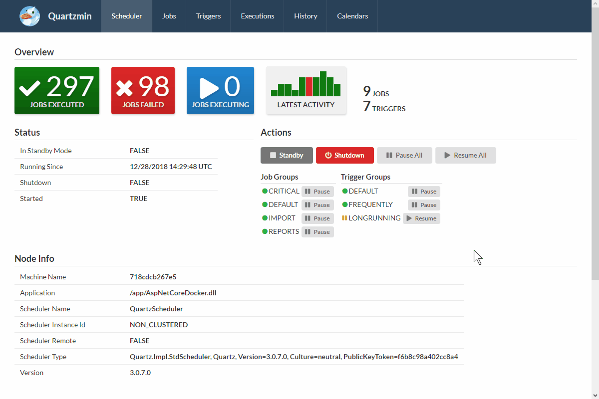
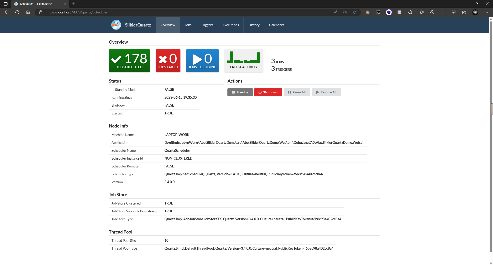
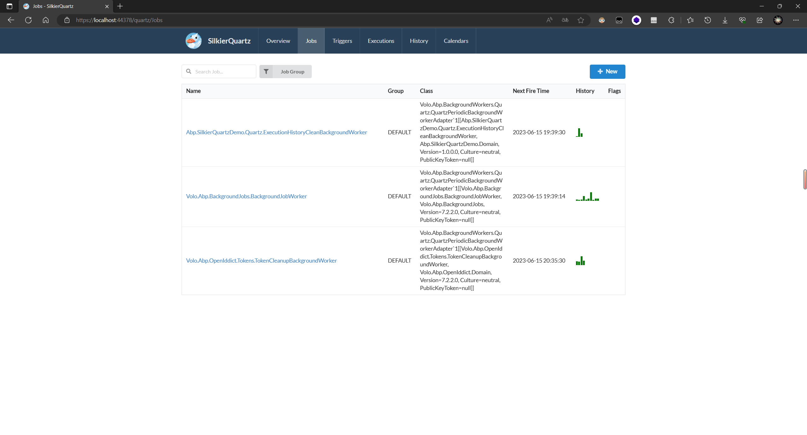
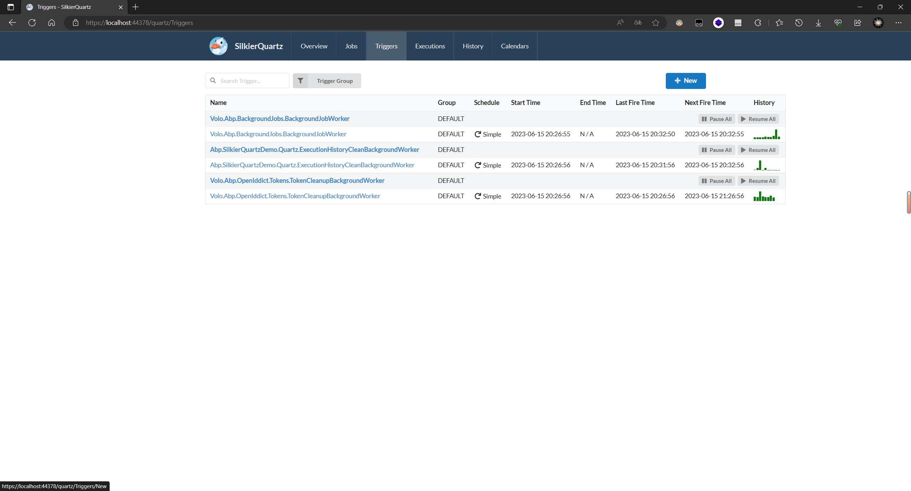
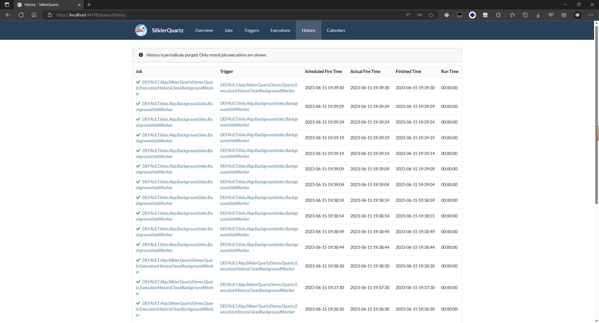

# 通过SilkierQuartz管理Quartz

## 介绍
abp framework支持使用**Quartz.Net**作为**BackgroundJob**和**BackgroundWorker**的实现. Quartz.Net拥有比Hangfire有更好的CRON格式支持（支持秒），更强大的触发器，日历等。但遗憾的是它没有类似Hangfire开箱即用的仪表板. 本文将借助[SilkierQuartz](https://github.com/maikebing/SilkierQuartz)使你将可以获得类似的体验.

**SilkierQuartz**由[Quartzmin](https://github.com/jlucansky/Quartzmin)发展而来.

通过`SilkierQuartz`让我们拥有一个功能丰富的Darkboard, 管理我们的Job和执行历史.



## 初始化项目

1. 创建项目, 然后运行`DbMigrator`

```bash
abp new Abp.SilkierQuartzDemo -t app
```

2. 添加Quartz的**BackgroundJob**和**BackgroundWorker**实现包到`Abp.SilkierQuartzDemo.Web`

```bash
abp add-package Volo.Abp.BackgroundJobs.Quartz
abp add-package Volo.Abp.BackgroundWorkers.Quartz
dotnet add package Quartz.Serialization.Json --version 3.4.0 # Match Volo.Abp.Quartz's Quartz version
```

3. 配置Quartz以使用SqlServer持久化作业
```csharp
public override void PreConfigureServices(ServiceConfigurationContext context)
{
    var configuration = context.Services.GetConfiguration();

    ...

    PreConfigure<AbpQuartzOptions>(options =>
    {
        options.Configurator = configure =>
        {
            configure.UsePersistentStore(storeOptions =>
            {
                storeOptions.UseProperties = true;
                storeOptions.UseJsonSerializer();
                storeOptions.UseSqlServer(configuration.GetConnectionString("Default")!);
                storeOptions.UseClustering(c =>
                {
                    c.CheckinMisfireThreshold = TimeSpan.FromSeconds(20);
                    c.CheckinInterval = TimeSpan.FromSeconds(10);
                });
            });
        };
    });
}
```

> 详细配置请查看[文档](https://docs.abp.io/en/abp/latest/Background-Jobs-Quartz#configuration)

> 选择你的对于的数据库类型, 初始化Quartz数据表. https://github.com/quartznet/quartznet/tree/main/database/tables

## 安装SilkierQuartz

1. 安装`SilkierQuartz`到`Abp.SilkierQuartzDemo.Web`
```bash
dotnet add package SilkierQuartz --version 5.0.356
```

2. 添加`AbpSilkierQuartzExtensions.cs`到`Abp.SilkierQuartzDemo.Web`
```csharp
public static class AbpSilkierQuartzExtensions
{
    private const string DefaultVirtualPathRoot = "/quartz";

    public static IApplicationBuilder UseAbpSilkierQuartz(
        this IApplicationBuilder app,
        Action<SilkierQuartz.SilkierQuartzOptions>? actionOptions = null)
    {
        var options = new SilkierQuartz.SilkierQuartzOptions()
        {
            Logo = app.ApplicationServices.GetRequiredService<IBrandingProvider>().LogoUrl ?? "Content/Images/logo.png",
            Scheduler = app.ApplicationServices.GetRequiredService<IScheduler>(),
            VirtualPathRoot = DefaultVirtualPathRoot,
            UseLocalTime = true,
            DefaultDateFormat = "yyyy-MM-dd",
            DefaultTimeFormat = "HH:mm:ss",
            CronExpressionOptions = new CronExpressionDescriptor.Options()
            {
                DayOfWeekStartIndexZero = false //Quartz uses 1-7 as the range
            }
        };

        actionOptions?.Invoke(options);

        var fsOptions = new FileServerOptions()
        {
            RequestPath = new PathString($"{options.VirtualPathRoot}/Content"),
            EnableDefaultFiles = false,
            EnableDirectoryBrowsing = false,
            FileProvider = new EmbeddedFileProvider(typeof(SilkierQuartz.SilkierQuartzOptions).Assembly, "SilkierQuartz.Content")
        };

        app.UseFileServer(fsOptions);

        var services = SilkierQuartz.Services.Create(options, null);

        app.Use(async (context, next) =>
        {
            context.Items[typeof(SilkierQuartz.Services)] = services;
            await next();
        });

        return app;
    }

    public static void MapAbpSilkierQuartz(this IEndpointRouteBuilder routeBuilder, string virtualPathRoot = DefaultVirtualPathRoot)
    {
        routeBuilder.MapControllerRoute(nameof(SilkierQuartz), $"{virtualPathRoot}/{{controller=Scheduler}}/{{action=Index}}");
    }
}
```

3. 配置`ProjectNameWebModule`, 对`SilkierQuartz`控制器跳过AntiForgery验证, 配置路由
```csharp
...
public class SilkierQuartzDemoWebModule : AbpModule
{
    public override void ConfigureServices(ServiceConfigurationContext context)
    {   
        ...
        Configure<AbpAntiForgeryOptions>(options =>
        {
            options.AutoValidateFilter = type => !type.FullName!.StartsWith("SilkierQuartz.Controllers");
        });
    }

    public override void OnApplicationInitialization(ApplicationInitializationContext context)
    {
        var app = context.GetApplicationBuilder();
        ...
        app.UseAbpSilkierQuartz();
        app.UseConfiguredEndpoints(endpoints =>
        {
            endpoints.MapAbpSilkierQuartz();
        });
    }
}
```

4. 配置权限`ProjectNamePermissionDefinitionProvider`
```csharp
public override void Define(IPermissionDefinitionContext context)
{
    var myGroup = context.AddGroup(SilkierQuartzDemoPermissions.GroupName);

    // 权限名称必须是'SilkierQuartz'
    myGroup.AddPermission("SilkierQuartz", L("Permission:SilkierQuartz"));
    ...
}
```

5. 运行`DbMigrator`

6. 启动并访问, 'https://your-host/quartz'. 现在你可以基本预览**SilkierQuartz**
   
## 实现ExecutionHistory持久化

默认的SilkierQuartz的执行记录使用内存实现. 我们可以通过abp实现数据库持久化.
由于代码较多, 下文仅展示重要部分, 详细信息请参考[提交](https://github.com/JadynWong/Abp.SilkierQuartzDemo/commit/45667f59a8d8d250397068242eebd2dd511ef118)

1. 添加`SilkierQuartz.Plugins.RecentHistory`到`Abp.SilkierQuartzDemo.Domain`

```bash
dotnet add package SilkierQuartz.Plugins.RecentHistory
```

2. 在`Abp.SilkierQuartzDemo.Domain`创建Quartz目录后, 添加实体`QuartzJobSummary`和`QuartzExecutionHistory`
```csharp
public class QuartzExecutionHistory : BasicAggregateRoot<Guid>
{
    public string FireInstanceId { get; protected set; } = null!;

    public string SchedulerInstanceId { get; set; } = null!;

    public string SchedulerName { get; set; } = null!;

    public string? Job { get; set; }

    public string? Trigger { get; set; }

    public DateTime? ScheduledFireTimeUtc { get; set; }

    public DateTime ActualFireTimeUtc { get; set; }

    public bool Recovering { get; set; }

    public bool Vetoed { get; set; }

    public DateTime? FinishedTimeUtc { get; set; }

    public string? ExceptionMessage { get; set; }

    protected QuartzExecutionHistory()
    {

    }

    public QuartzExecutionHistory(Guid id, string fireInstanceId) : base(id)
    {
        FireInstanceId = fireInstanceId;
    }
}

public class QuartzJobSummary : BasicAggregateRoot<Guid>
{
    public string SchedulerName { get; protected set; } = null!;

    public int TotalJobsExecuted { get; set; }

    public int TotalJobsFailed { get; set; }

    protected QuartzJobSummary()
    {

    }

    public QuartzJobSummary(Guid id, string schedulerName) : base(id)
    {
        SchedulerName = schedulerName;
    }
}

```

3. 添加`IQuartzExecutionHistoryRepository`和`IQuartzJobSummaryRepository`接口, 然后在EntityFrameworkCore中实现.
```csharp
public interface IQuartzExecutionHistoryRepository : IBasicRepository<QuartzExecutionHistory, Guid>
{
    Task<QuartzExecutionHistory?> FindByFireInstanceIdAsync(string fireInstanceId, CancellationToken cancellationToken = default);

    Task<List<QuartzExecutionHistory>> GetLastOfEveryJobAsync(string schedulerName, int limitPerJob, CancellationToken cancellationToken = default);

    Task<List<QuartzExecutionHistory>> GetLastOfEveryTriggerAsync(
        string schedulerName,
        int limitPerTrigger,
        int skipPerTrigger = 0,
        CancellationToken cancellationToken = default);

    Task<List<QuartzExecutionHistory>> GetLastAsync(string schedulerName, int limit, CancellationToken cancellationToken = default);

    Task PurgeAsync(CancellationToken cancellationToken = default);
}

public interface IQuartzJobSummaryRepository : IBasicRepository<QuartzJobSummary, Guid>
{
    Task<QuartzJobSummary?> FindBySchedulerNameAsync(string schedulerName, CancellationToken cancellationToken = default);

    Task<int> GetTotalJobsExecutedAsync(string schedulerName, CancellationToken cancellationToken = default);

    Task<int> GetTotalJobsFailedAsync(string schedulerName, CancellationToken cancellationToken = default);

    Task IncrementTotalJobsExecutedAsync(string schedulerName, CancellationToken cancellationToken = default);

    Task IncrementTotalJobsFailedAsync(string schedulerName, CancellationToken cancellationToken = default);
}
```

4. 配置`ProjectNameDbContext`
```csharp
protected override void OnModelCreating(ModelBuilder builder)
{
    ...
    builder.Entity<QuartzExecutionHistory>(b =>
    {
        b.ToTable("QuartzExecutionHistories", SilkierQuartzDemoConsts.DbSchema);
        b.ConfigureByConvention();

        /* Configure more properties here */
        b.Property(x => x.FireInstanceId).HasMaxLength(200);
        b.Property(x => x.SchedulerInstanceId).HasMaxLength(200);
        b.Property(x => x.SchedulerName).HasMaxLength(200);
        b.Property(x => x.Job).HasMaxLength(300);
        b.Property(x => x.Trigger).HasMaxLength(300);

        b.HasIndex(x => x.FireInstanceId);
    });

    builder.Entity<QuartzJobSummary>(b =>
    {
        b.ToTable("QuartzJobSummares", SilkierQuartzDemoConsts.DbSchema);
        b.ConfigureByConvention();

        /* Configure more properties here */
        b.Property(x => x.SchedulerName).HasMaxLength(200);
    });
}
```

5. 添加`AbpExecutionHistoryStore`以实现`IExecutionHistoryStore`
```csharp
public class AbpExecutionHistoryStore : IExecutionHistoryStore, ISingletonDependency
{
    public string SchedulerName { get; set; } = null!;

    protected IServiceScopeFactory ServiceScopeFactory = null!;

    public ILogger<AbpExecutionHistoryStore> Logger { get; set; }

    public AbpExecutionHistoryStore()
    {
        Logger = NullLogger<AbpExecutionHistoryStore>.Instance;
    }

    public AbpExecutionHistoryStore(
        IServiceScopeFactory serviceScopeFactory) : this()
    {
        ServiceScopeFactory = serviceScopeFactory;
    }

    public async Task<ExecutionHistoryEntry?> Get(string fireInstanceId)
    {
        using var scope = ServiceScopeFactory.CreateScope();
        var repository = scope.ServiceProvider.GetRequiredService<IQuartzExecutionHistoryRepository>();

        var quartzJobHistory = await repository.FindByFireInstanceIdAsync(fireInstanceId);
        if (quartzJobHistory == null)
        {
            return null;
        }
        return quartzJobHistory.ToEntry();
    }

    public async Task Purge()
    {
        using var scope = ServiceScopeFactory.CreateScope();
        var repository = scope.ServiceProvider.GetRequiredService<IQuartzExecutionHistoryRepository>();

        await repository.PurgeAsync();
    }

    public async Task Save(ExecutionHistoryEntry entry)
    {
        using var scope = ServiceScopeFactory.CreateScope();
        var guidGenerator = scope.ServiceProvider.GetRequiredService<IGuidGenerator>();
        var repository = scope.ServiceProvider.GetRequiredService<IQuartzExecutionHistoryRepository>();

        var quartzJobHistory = await repository.FindByFireInstanceIdAsync(entry.FireInstanceId);
        if (quartzJobHistory == null)
        {
            quartzJobHistory = entry.ToEntity(new QuartzExecutionHistory(guidGenerator.Create(), entry.FireInstanceId));
            await repository.InsertAsync(quartzJobHistory);
        }
        else
        {
            quartzJobHistory = entry.ToEntity(quartzJobHistory);
            await repository.UpdateAsync(quartzJobHistory);
        }
    }

    public async Task<IEnumerable<ExecutionHistoryEntry>> FilterLastOfEveryJob(int limitPerJob)
    {
        using var scope = ServiceScopeFactory.CreateScope();
        var repository = scope.ServiceProvider.GetRequiredService<IQuartzExecutionHistoryRepository>();

        var quartzJobHistories = await repository.GetLastOfEveryJobAsync(SchedulerName, limitPerJob);

        return quartzJobHistories.Select(x => x.ToEntry());
    }

    public async Task<IEnumerable<ExecutionHistoryEntry>> FilterLastOfEveryTrigger(int limitPerTrigger)
    {
        using var scope = ServiceScopeFactory.CreateScope();
        var repository = scope.ServiceProvider.GetRequiredService<IQuartzExecutionHistoryRepository>();

        var quartzJobHistories = await repository.GetLastOfEveryTriggerAsync(SchedulerName, limitPerTrigger);

        return quartzJobHistories.Select(x => x.ToEntry());
    }

    public async Task<IEnumerable<ExecutionHistoryEntry>> FilterLast(int limit)
    {
        using var scope = ServiceScopeFactory.CreateScope();
        var repository = scope.ServiceProvider.GetRequiredService<IQuartzExecutionHistoryRepository>();

        var quartzJobHistories = await repository.GetLastAsync(SchedulerName, limit);

        return quartzJobHistories.Select(x => x.ToEntry());
    }

    public async Task<int> GetTotalJobsExecuted()
    {
        using var scope = ServiceScopeFactory.CreateScope();
        var repository = scope.ServiceProvider.GetRequiredService<IQuartzJobSummaryRepository>();

        return await repository.GetTotalJobsExecutedAsync(SchedulerName);
    }

    public async Task<int> GetTotalJobsFailed()
    {
        using var scope = ServiceScopeFactory.CreateScope();
        var repository = scope.ServiceProvider.GetRequiredService<IQuartzJobSummaryRepository>();

        return await repository.GetTotalJobsFailedAsync(SchedulerName);
    }

    public async Task IncrementTotalJobsExecuted()
    {
        using var scope = ServiceScopeFactory.CreateScope();
        var repository = scope.ServiceProvider.GetRequiredService<IQuartzJobSummaryRepository>();

        await repository.IncrementTotalJobsExecutedAsync(SchedulerName);
    }

    public async Task IncrementTotalJobsFailed()
    {
        using var scope = ServiceScopeFactory.CreateScope();
        var repository = scope.ServiceProvider.GetRequiredService<IQuartzJobSummaryRepository>();

        await repository.IncrementTotalJobsFailedAsync(SchedulerName);
    }

    public virtual async Task InitializeSummaryAsync()
    {
        using var scope = ServiceScopeFactory.CreateScope();
        var unitOfWorkManager = scope.ServiceProvider.GetRequiredService<IUnitOfWorkManager>();
        var repository = scope.ServiceProvider.GetRequiredService<IQuartzJobSummaryRepository>();
        var guidGenerator = scope.ServiceProvider.GetRequiredService<IGuidGenerator>();

        using var uow = unitOfWorkManager.Begin(true);

        var quartzJobSummary = await repository.FindBySchedulerNameAsync(SchedulerName);
        if (quartzJobSummary == null)
        {
            quartzJobSummary = new QuartzJobSummary(guidGenerator.Create(), SchedulerName);
            await repository.InsertAsync(quartzJobSummary);
        }

        await uow.CompleteAsync();
    }
}
```

6. 添加`AbpExecutionHistoryPlugin`以实现`ISchedulerPlugin`, `IJobListener`
```csharp
public class AbpExecutionHistoryPlugin : ISchedulerPlugin, IJobListener
{
    private IScheduler _scheduler = null!;
    private IExecutionHistoryStore _store = null!;

    public Type StoreType { get; set; } = null!;

    public string Name { get; protected set; } = string.Empty;

    public Task Initialize(string pluginName, IScheduler scheduler, CancellationToken cancellationToken = default)
    {
        Name = pluginName;
        _scheduler = scheduler;
        _scheduler.ListenerManager.AddJobListener(this, EverythingMatcher<JobKey>.AllJobs());

        return Task.FromResult(0);
    }

    public async Task Start(CancellationToken cancellationToken = default)
    {
        _store = _scheduler.Context.GetExecutionHistoryStore();

        if (_store == null)
        {
            throw new AbpException(nameof(StoreType) + " is not set.");
        }

        _store.SchedulerName = _scheduler.SchedulerName;

        if (_store is AbpExecutionHistoryStore abpStore)
            await abpStore.InitializeSummaryAsync();

        await _store.Purge();
    }

    public Task Shutdown(CancellationToken cancellationToken = default)
    {
        return Task.CompletedTask;
    }

    public async Task JobToBeExecuted(IJobExecutionContext context, CancellationToken cancellationToken = default)
    {
        var entry = new ExecutionHistoryEntry()
        {
            FireInstanceId = context.FireInstanceId,
            SchedulerInstanceId = context.Scheduler.SchedulerInstanceId,
            SchedulerName = context.Scheduler.SchedulerName,
            ActualFireTimeUtc = context.FireTimeUtc.UtcDateTime,
            ScheduledFireTimeUtc = context.ScheduledFireTimeUtc?.UtcDateTime,
            Recovering = context.Recovering,
            Job = context.JobDetail.Key.ToString(),
            Trigger = context.Trigger.Key.ToString(),
        };
        await _store.Save(entry);
    }

    public async Task JobWasExecuted(IJobExecutionContext context, JobExecutionException? jobException, CancellationToken cancellationToken = default)
    {
        var entry = await _store.Get(context.FireInstanceId);
        if (entry != null)
        {
            entry.FinishedTimeUtc = DateTime.UtcNow;
            entry.ExceptionMessage = jobException?.GetBaseException()?.ToString();
        }
        else
        {
            entry = new ExecutionHistoryEntry()
            {
                FireInstanceId = context.FireInstanceId,
                SchedulerInstanceId = context.Scheduler.SchedulerInstanceId,
                SchedulerName = context.Scheduler.SchedulerName,
                ActualFireTimeUtc = context.FireTimeUtc.UtcDateTime,
                ScheduledFireTimeUtc = context.ScheduledFireTimeUtc?.UtcDateTime,
                Recovering = context.Recovering,
                Job = context.JobDetail.Key.ToString(),
                Trigger = context.Trigger.Key.ToString(),
                FinishedTimeUtc = DateTime.UtcNow,
                ExceptionMessage = jobException?.GetBaseException()?.ToString()
            };
        }
        await _store.Save(entry);

        if (jobException == null)
            await _store.IncrementTotalJobsExecuted();
        else
            await _store.IncrementTotalJobsFailed();
    }

    public async Task JobExecutionVetoed(IJobExecutionContext context, CancellationToken cancellationToken = default)
    {
        var entry = await _store.Get(context.FireInstanceId);
        if (entry != null)
        {
            entry.Vetoed = true;
            await _store.Save(entry);
        }
    }
}
```

7. 添加`ExecutionHistoryCleanBackgroundWorker`后台工作者, 用于清理执行历史
```csharp
public class ExecutionHistoryCleanBackgroundWorker : AsyncPeriodicBackgroundWorkerBase, ITransientDependency
{
    public ExecutionHistoryCleanBackgroundWorker(AbpAsyncTimer timer, IServiceScopeFactory serviceScopeFactory)
        : base(timer, serviceScopeFactory)
    {
        Timer.Period = 1000 * 60; //1 minutes
    }

    protected override async Task DoWorkAsync(PeriodicBackgroundWorkerContext workerContext)
    {
        Logger.LogDebug("ExecutionHistoryCleanBackgroundWorker executing");

        await LazyServiceProvider
            .LazyGetRequiredService<AbpExecutionHistoryStore>()
            .Purge();

        Logger.LogDebug("ExecutionHistoryCleanBackgroundWorker executed");
    }
}
```

8. 注册`ExecutionHistoryCleanBackgroundWorker`, 配置`ExecutionHistoryStore`
```csharp
public class SilkierQuartzDemoDomainModule : AbpModule
{
    ...
    public override void OnPreApplicationInitialization(ApplicationInitializationContext context)
    {
        var scheduler = context.ServiceProvider.GetRequiredService<IScheduler>();
        var executionHistoryStore = context.ServiceProvider.GetRequiredService<AbpExecutionHistoryStore>();
        scheduler.Context.SetExecutionHistoryStore(executionHistoryStore);
    }

    public override async Task OnApplicationInitializationAsync(ApplicationInitializationContext context)
    {
        await base.OnApplicationInitializationAsync(context);

        await context.AddBackgroundWorkerAsync<ExecutionHistoryCleanBackgroundWorker>();
    }
}
```

9. 修改`AbpQuartzOptions`配置以注册我们的持久化实现
```diff
PreConfigure<AbpQuartzOptions>(options =>
{
    options.Configurator = configure =>
    {
+       configure.SetProperty("quartz.plugin.recentHistory.type", typeof(AbpExecutionHistoryPlugin).AssemblyQualifiedNameWithoutVersion());
+       configure.SetProperty("quartz.plugin.recentHistory.storeType", typeof(AbpExecutionHistoryStore).AssemblyQualifiedNameWithoutVersion());
        configure.UsePersistentStore(storeOptions =>
        {
            storeOptions.UseProperties = true;
            storeOptions.UseJsonSerializer();
            storeOptions.UseSqlServer(configuration.GetConnectionString("Default")!);
            storeOptions.UseClustering(c =>
            {
                c.CheckinMisfireThreshold = TimeSpan.FromSeconds(20);
                c.CheckinInterval = TimeSpan.FromSeconds(10);
            });
        });
    };
});
```

10.  在EntityFramework项目生成迁移记录并应用
```bash
dotnet ef migrations add Added_QuartzRecentHistory
dotnet ef database update
```

11.  启动并访问, 'https://your-host/quartz/History'. 现在你可以查看执行历史记录.

## 预览

### Overview

### Jobs

### Triggers

### Hostory


示例 https://github.com/JadynWong/Abp.SilkierQuartzDemo
